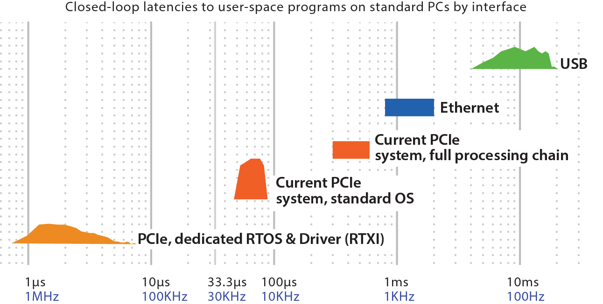

# Open Instruments Whitepaper
(extended version)

## Overview

This whitepaper outlines an instrumentation system for neuroscience (and other fields) that makes full use of existing technologies and industry standards to deliver the highest possible performance and modularity. The system can be used as a platform for any existing and future data sources, reducing development overhead, without imposing any performance or usability drawbacks. This also result in extendability to future interface technology generations without the need for device specific re-engineering.

We have built a prototype system based on parts of these specifications that delivers full use of the PCIe bus (12Gbps troughput currently, up to 100Gbps with other FPGA boards) for >10.000 channels sampled at 30kHz, and low latency of  <100μs round trip to and from host PC, so that high level languages and libraries can be used for closed-loop experiments. The same system could also be used for dynamic clamp applications using a real-time OS, delivering <10μs loop capability. 

The open instruments standard does not specify or constrain the design of either the data sources, nor the software used for data acquisition, but specifies a flexible interconnect between the two. 

To implement a system based on new type of probe, only two or three components need to be designed: 

(__1__) A hardware interface that connects directly to FPGA pins trough a standardized high-speed digital interconnect via generic 68-pin VHDCI connectors and cables that are connected to the FPGA boards via the ubiquitous FMC connectors and an intermediate DIO board as mechanical interconnect.

(__2__) A firmware module for the FPGA that drives this hardware, but does not need to be able to communicate with the host PC, or be developed with drivers in mind.

(__3__, optional) A software that communicates with this hardware through the open instruments AI that provides a generic interface to the hardware via data transfers and device registers, and can be used with no knowledge of the underlying interconnect (PCIe, USB, Ethernet).

By removing and standardizing the intermediate components of hardware-software interfaces, the development effort required for this is vastly reduced, and different data sources can be operated together in one system.

## Progress & Proof of Principle

Latency mesaurements

Computational tractability

## Specification overview

### Interface for hardware modules

Principle

VHDCI spec

### Hardware: DIO card & FPGA eval card

There are only two hardware components of the system that are defined by this specification:
- An off-the shelf FPGA eval board (Kintex 7)
- A very simple DIO card that directly connects pins on the FPGA to connnectors on the back of the host PC

overview

### Interfaces for firmware module 

IP core interfaces

Generic HW interface module

### Software interfaces

Principle

API

## Next steps

Make baseline HW modules

Make DIO card

Implement API around an existing PCIe  firmware&driver

Interfaces to commercial systems via generic firmware module